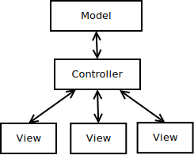
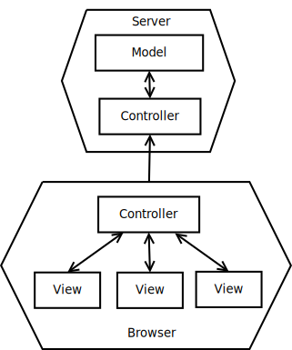
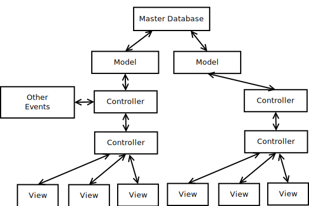

1
# Nodejs

# JavaScript outside the browser.

---

## Dan Lyke

- HYPER! HTML browser circa 1993
- "Blogger" since before PeterMe coined the term.
- Bit pusher - video codecs, embedded devices, etc.

---

## Why JavaScript sucks and ...

Greenspun's Tenth Rule:

<blockquote>Any sufficiently complicated C or Fortran program contains an ad hoc, informally-specified, bug-ridden, slow implementation of half of Common Lisp.</blockquote>

aka JavaScript

- Bad language features: comparisons, semicolons, ambiguity
- No typing
- Blurs content and presentation in horrible ways
- Get off my lawn

---

## and why you should use it everywhere

It's already everywhere.

- Cross-platform client+local-server apps
- Deployed more places than Java
- Asm.js - VM of the future
- Security is scary, browsers are everywhere.

---

## MVC Architecture

- How we think about applications
- Multiple windows on the same data
- Single data store

---

## View

- View knows how to display stuff

---

## Controller

- Controller aggregates changes & distributes to views

---

## Model

- Data Store + Business rules
- "Real" enterprises often do this in SQL
- "[X] is not a database"

---

## Business Rules

A few silly examples:

- Inventory Control
- Double Entry Bookkeeping
- Password Policy

Less silly examples:

- Rental policies
- Discount conditions
- CRM

---

## M->C->C->V Architecture

- Web apps may need controllers (on servers) talking to controllers
  (in browsers).

---

## Datastore->Ms->C->C->V

- Central atomic data store
- Multiple replicated data stores
- Redundant Model instances talking to both.

---

## Application in the Browser

- Minimize round-trips
- Avoid re-sending lots of HTML, just JSON
- Became the dominant mode, then abandoned (Twitter, etc).
- Same templates server and browser side, hybrid solutions.

---

## Sharing model constraints

- Can't depend on the client to abide by constraints.
- Don't want to duplicate code.
- Especially don't want divergent code (different regex engines, etc)

---

## Test Driven Development

- "make && make test && make deploy"
- Hard to do if tests involve human interaction.
- Sixteen hour test runs...

---

## Nodejs - command line and server JavaScript

- Hello, World: console.log("Hello, World");
- Autocomplete

node helloworld.js

---

## Common use of libraries

- commonfunc.js builds an export table
- clientfile.html runs it in the browser
- hello2.js runs it from the command-line

---

## Testing

test/test.js

- jshint lints it
- mocha tests it.
- Integrate into deployment, ie in Makefile:

<pre>deploy: ...
	jshint *.js
	mocha tests
    rsync ... remote@server:/path/to/project
    ...
</pre>

---

## npm - Node Package Manager

- -g to install globally, people like local installation
- also runs packages.

---

## Nodejs - server

A computer is a state machine. Threads are for people who can't
program state machines.  Alan Cox

- event-driven
- easy to combine server types
- lots of functionality layering

---

## RPC servers

<pre>// Load the TCP Library
net = require('net');
var common = require('./commonfunc.js');

// Start a TCP Server
net.createServer(
    function (socket) 
    {
        socket.on('data',
                  function(data)
                  {
                      var s = "" + data;
                      socket.write(common.doubleIt(s.replace("\n",""))
                                   + "\n");
                      
                  });
    }
).listen(5000)</pre>

---

## HTML servers

<pre>## RPC servers

<pre>// Load the TCP Library
net = require('net');
var common = require('./commonfunc.js');

// Start a TCP Server
net.createServer(
    function (socket) 
    {
        socket.on('data',
                  function(data)
                  {
                      var s = "" + data;
                      socket.write(common.doubleIt(s.replace("\n",""))
                                   + "\n");
                      
                  });
    }
).listen(5000)</pre>

---

## HTML servers

<pre>var http = require('http');
http.createServer(function (req, res) {
  res.writeHead(200, {'Content-Type': 'text/plain'});
  res.end('Hello World\n');
}).listen(1337, '127.0.0.1');
</pre>

---

## Standing on the feet of giants

- ShareJS
- LiveDB
- Meteor
- Ember
- Bla bla bla

---

## Derby demo

- cd derbyjs/first-project
- npm start
- emacs views/app/home.html lib/app/index.js 

---

## Derby vs Meteor

- Meteor: GPL, own package manager, "Fibers"
- Derby: MIT, npm, callbacks

---

## Do I have to write in JavaScript?

- Coffeescript
- ActionScript
- C++/emscripten/clang/LLVM
- LLVM means ActionScript, Ada, D, Fortran, OpenGL Shading Language,
  Haskell, Julia, Objective-C, Python, Ruby, Rust,
  Scala
- C means ... well ... pretty much anything.
- parenscript

---

## Other technology of note

- OS/X jsc

