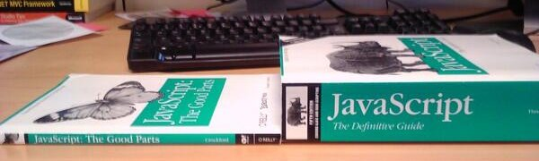

# Nodejs

# JavaScript outside the browser.

---

## Dan Lyke

- HYPER! HTML browser circa 1993
- "Blogger" since before PeterMe coined the term.
- Bit pusher - video codecs, embedded devices, etc.

---

## Why JavaScript sucks ...

Greenspun's Tenth Rule:

<blockquote>Any sufficiently complicated C or Fortran program contains an ad hoc, informally-specified, bug-ridden, slow implementation of half of Common Lisp.</blockquote>

aka JavaScript

---

## Why JavaScript sucks ...

"A web app is a website that doesn't work when Javascript is disabled." - Jeremy Keith @adactio

- Bad language features: comparisons, semicolons, ambiguity
- No typing
- Blurs content and presentation in horrible ways
- Testing and debugging are hard
- Get off my lawn

---

## and why you should use it.

It's already everywhere.

- Cross-platform client+local-server apps
- Deployed more places than Java
- Asm.js - VM of the future
- Security is scary, browsers are everywhere.
- Customers attracted by blinky lights are very profitable!

---

## MVC Architecture

- How we think about applications
- Multiple windows on the same data
- Single data store

---

## MVC condensed

- View knows how to display stuff
- Controller aggregates changes & distributes to views
- Model is the Data Store + Business rules: "Real" enterprises often do this in SQL

---

## Business Rules

A few silly examples:

- Inventory Control
- Double Entry Bookkeeping
- Password Policy

Less silly examples:

- Rental policies
- Discount conditions
- CRM

---

## [X] is not a database

Or at least doesn't make a model.

- MySQL is not a database
- MongoDB is not a database
- Excel is not a database
  (but you knew that)
- Get off my lawn

---

## M->C->C->V Architecture

- Web apps may need controllers (on servers) talking to controllers
  (in browsers).

---

## Datastore->Ms->C->C->V

- Central atomic data store
- Multiple replicated data stores
- Redundant Model instances talking to both.

---

## Sharing Model constraints

- Can't depend on the client to abide by constraints.
- Don't want to duplicate code.
- Especially don't want divergent code (different regex engines, etc)

---

## Test Driven Development

- "make && make test && make deploy"
- Hard to do if tests involve human interaction.
- Sixteen hour test runs...

---

## Nodejs - stand-alone JavaScript

- Hello, World: console.log("Hello, World");
- Autocomplete

Run "node", it gives you a prompt, type "console.", hit tab, *boom*,
list of methods to the console object.

node helloworld.js

---

## Common use of libraries

- commonfunc.js builds an export table
- clientfile.html runs it in the browser
- hello2.js runs it from the command-line

---

## commonfunc.js

<pre>(function(exports) {
 
// Define all your functions on the
// exports object
    exports.doubleIt = function(it) {
        it = Number(it);
        return it + it;
    };
})((typeof process === 'undefined'
    || !process.versions) ?
   window.common = window.common || {}
   : exports);
</pre>

---

## use it from HTML

HTML:

<pre>&lt;html&gt;&lt;head&gt; 
&lt;script src="commonfunc.js"&gt;&lt;/script&gt;
&lt;/head&gt;&lt;body&gt;
 &lt;script&gt;
var it = 2;
alert("Doubling "+it+" yields "
   + window.common.doubleIt(2));
&lt;/script&gt;
&lt;/body&gt;&lt;/html&gt;</pre>

---

## From the command-line

<pre>var common = require('./commonfunc.js');
console.log("Doubling 2 to get "
            + common.doubleIt(2));
</pre>

---

## Test it

test/test.js

- jshint lints it
- mocha tests it.
- Integrate into deployment, ie in Makefile:

<pre>deploy: ...
	jshint *.js
	mocha tests
    rsync ... remote@server:/path/to/project
    ...
</pre>

---

## Write tests

<pre>var assert = require("assert");
var common = require('../commonfunc.js');

describe('common', function(){
 describe('#doubleIt()', function() {
   it('should return 4 when called with 2',
     function()
     { 
       assert.equal(4, common.doubleIt(2))
     } );

    // and so forth ...

    })
});
</pre>

---

## npm - Node Package Manager

- -g to install globally, people like local installation
- also runs packages.

---

## Nodejs - server

A computer is a state machine. Threads are for people who can't
program state machines.  Alan Cox

- event-driven
- easy to combine server types
- lots of functionality layering

---

## RPC servers

<pre>// Load the TCP Library
net = require('net');
var common = require('./commonfunc.js');

// Start a TCP Server
net.createServer(
  function (socket) 
  {
    socket.on('data',
      function(data)
      { var s = "" + data;
        socket.write(
          common.doubleIt(s.replace("\n",""))
          + "\n"); });
  }).listen(5000)</pre>

---

## HTML servers

<pre>var http = require('http');
http.createServer(function (req, res) {
  res.writeHead(200, 
    {'Content-Type': 'text/plain'});
  res.end('Hello World\n');
}).listen(1337, '127.0.0.1');
</pre>

---

## HTTP server

<pre>var http = require('http');

var server = http.createServer(
  function (request, response) {
    response.writeHead(200,
      {"Content-Type": "text/plain"});
    response.end("Hello World\n");
});
server.listen(8000);
</pre>

---

## HTTP server with a router

<pre>var server =
   require('node-router').getServer();
server.get("/",
  function (request, response) {
  response.simpleText(200, "Hello World!");
});
server.listen(8000, "localhost");
</pre>

---

## Standing on the feet of giants

- Express
- Anyauth
- ShareJS - live concurrent editing
- LiveDB - database joiner/controller
- Derby
- Meteor
- Bla bla bla

---

## Application in the Browser

- Minimize round-trips
- Avoid re-sending lots of HTML, just JSON
- Became the dominant mode, then abandoned (Twitter, etc).
- Same templates server and browser side, hybrid solutions.

Hybrid solutions render HTML, send that HTML across along with enough
JavaScript to use that HTML as a template. This gives super fast
initial page rendering, and then allows JSON thereafter.

---

## Derby demo

- cd derbyjs/first-project
- npm start
- http://127.0.0.1:3000/
- Changes in one field show up in all other fields on all other browsers!
- emacs views/app/home.html lib/app/index.js 
- Saving home.html updates the browser too.

---

## Derby vs Meteor

- Meteor: GPL, own package manager, "Fibers", shakey security
- Derby: MIT, npm, callbacks, some support for JavaScript-less HTML (helloo accessibility!)

---

## So not quite there yet

Other languages have fully-formed frameworks and content management
systems, Node has some components upon which you can hang an app,
frameworks are still coming together.

---

## Do I have to write in JavaScript?

- Coffeescript
- ActionScript
- C++/emscripten/clang/LLVM
- LLVM means ActionScript, Ada, D, Fortran, OpenGL Shading Language,
  Haskell, Julia, Objective-C, Python, Ruby, Rust,
  Scala
- C means Python, Unreal, etc...
- parenscript

---

## Other technology of note

- OS/X jsc

---

## Questions?

- nodejs.org
- derbyjs.com

danlyke@flutterby.com
http://www.flutterby.net/User:DanLyke

